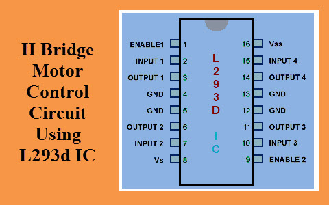

# Lesson 37: Controlling DC motors

## Warning:
1. Do not plug the motor direclty, it will fry your arduino off. 
2. We cannot instantly change current. Turning it off suddenly will burn the arduino off.
3. We need a common ground when we have multiple elements

## Precautions:
1. We will have a power supply module.
2. We will use a motor controller (L293D).
3. The arduino ground and the chip ground coincide.

## L293D schematic

This chip can control the speed and direction of 2 motors.

We need to use the digital pin with the ~ when we connect it to the enable. 

Motor 1:
+ EN1 (1) - controls the speed of motor1
+ IN1 (2) and IN2 (7) - 
    + High Low -> Forward
    + Low High -> Backwards
+ OUT1 (3) and OUT2 (6) - Red and black of the motor
+ 4 and 5 - Commond ground
+ 8 - Positve voltage from the power supply