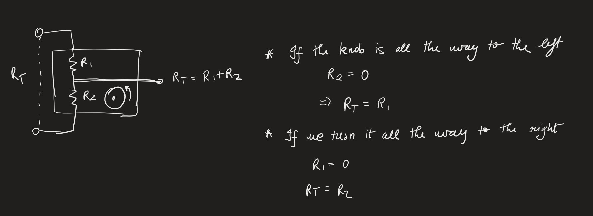
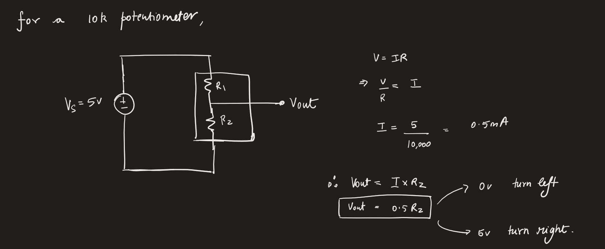

# Lesson 12: Playing with Potentiometers
In this lesson we will understand how potentiometers work.

Potentiometers are variable resistors. The output resistance can be controlled using a knob.

## Building intuition
### Schematic

### Example:

