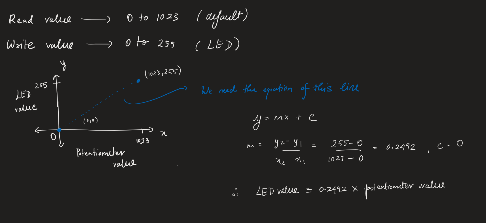

# Lesson 14: Dimmable LED project
Here we will create a dimmable LED using a potentiometer.

## Math:

## Result
When the potentiometer is to the right entirely:

When the potentiometer is to the left entirely:
