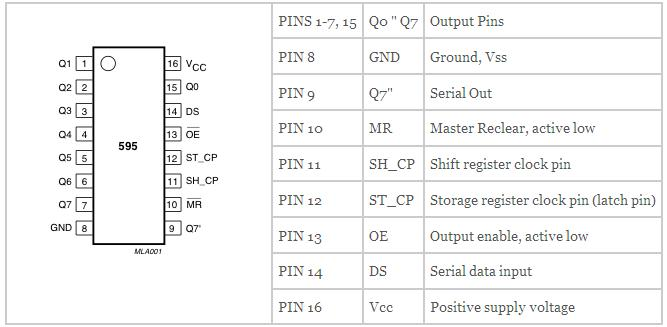

# Lesson 42: Understanding how to use a serial to parallel shift register (74HC595)

1. Pin 1 to 7 and Pin 15 are input pins
2. Pin 11 will help us sync the data. 
3. Pin 12 is latch pin is set low and then data is sent. After the data is sent, the latch is set to high.
4. Pin 14 serial data input 