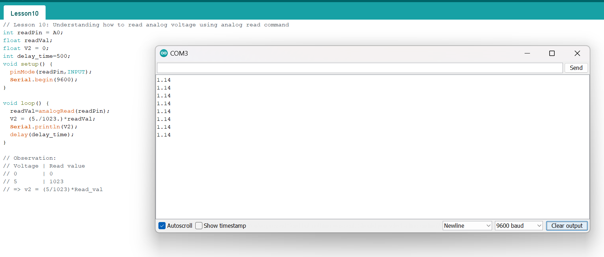

# Lesson 10: Understanding how to read analog voltage using analog read command
## Set-up:
The set up is like question 2 in Lesson 9 problems:
+ Probe a wire from the point where you want to read the signal.
+ Connect this wire to the Analog in side (A0 - A5)

Run the code given and open the serial monitor by clicking on the search button located on top right.

We can see that the measured voltage is very close to the calculated voltage from the previous lesson