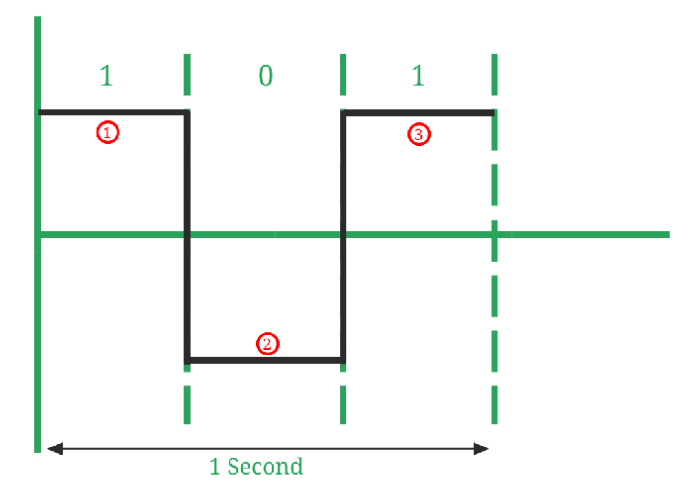

# Lesson 11: Understanding the Arduino Serial port and Print commands
Print commands are extremely useful for understanding what the computer thinks and is an essential part of troubleshooting. In this lesson we go through the different ways we can print datatypes and learn about baud rate of the Serial port. 

## What is baud?
The baud rate is the rate at which information is transferred in a communication channel. In the serial port context, "9600 baud" means that the serial port is capable of transferring a maximum of 9600 bits per second. If the information unit is one baud (one bit), then the bit rate and the baud rate are identical. The higher a baud rate is the faster the data is sent/received.

**Formula:** Baud rate = number of signal elements/total time (in seconds)

In the above image:
+ Number of signal elements (marked in red color) = 3 
+ Number of bits transmitted (1, 0, 1) = 3.

Baud rate = 3/1 = 3 baud per second.

### Why baud rate is important ?
Baud rate is important because: 
- Baud rate can determine the bandwidth requirements for transmission of the signal.
- Baud rate is also used for the calculation of the Bit rate of a communication channel.
- It is a tuning parameter (i.e., it adjusts the Network congestion in data networking) for the transmission of a signal.
- It specifies how fast data can be sent over a serial line or serial interface (it’s an interface that sends data as a series of bits over a single wire.).

*Note*: The baud rate set in the program **must** be the same as what is set in the serial monitor.

## Print commands.
|Use|Syntax|
|--|----|
|Start the serial monitor with a certain baud rate|Serial.begin(*baud rate*)|
|print in the same line|Serial.print(*data/variable*)|
|print in the next line|Serial.println(*data/variable*)|