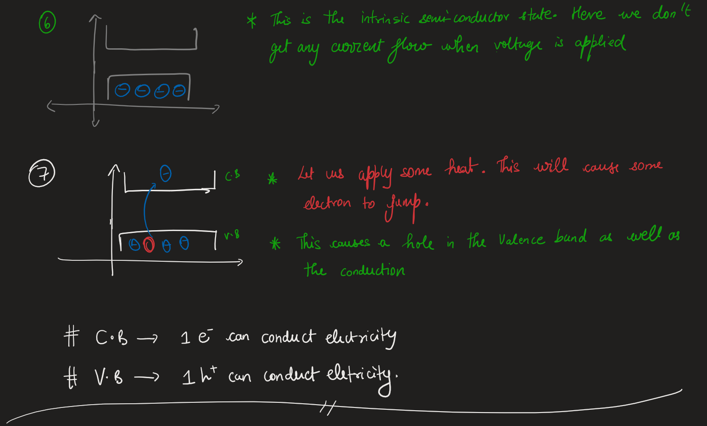
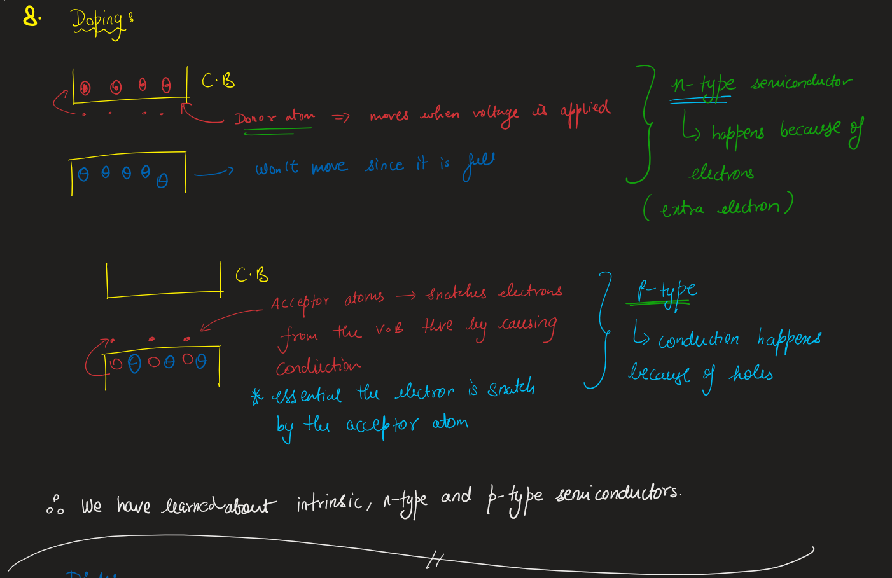
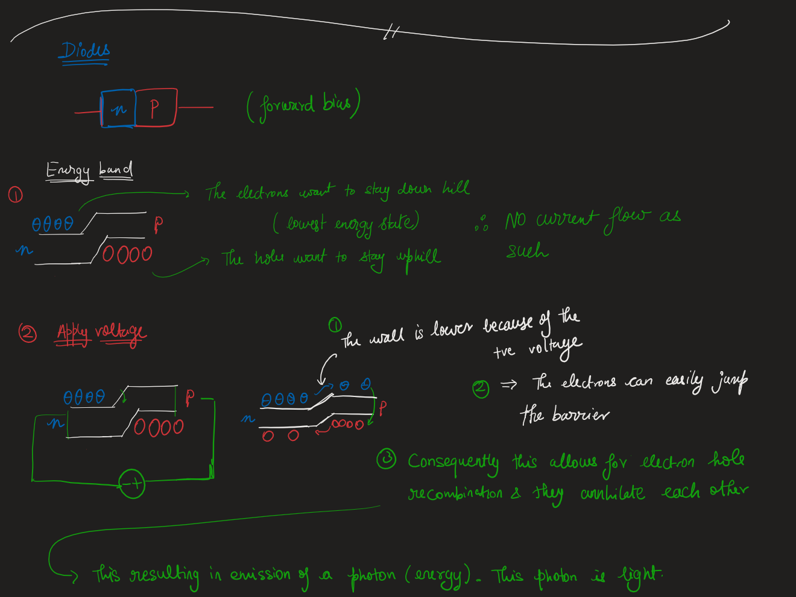
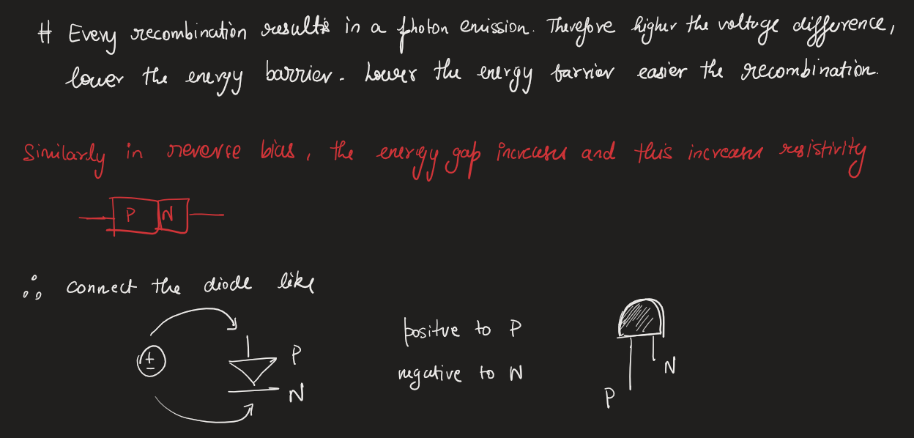
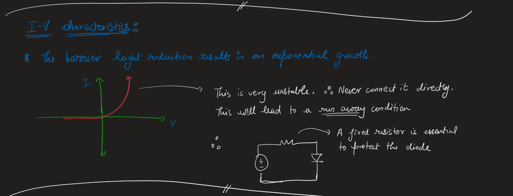
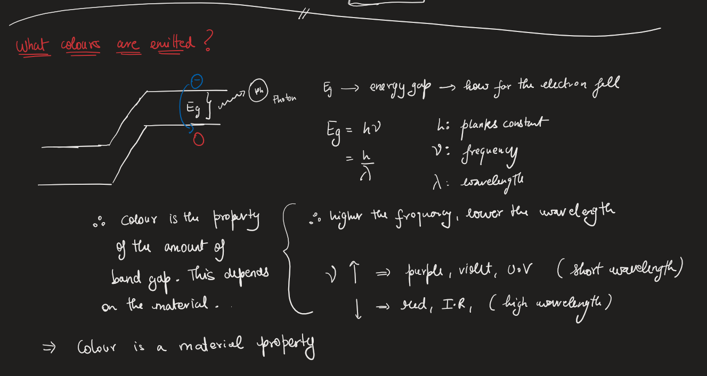

# Lesson 2 - Solid state physics
## How do semiconductors work?

## Doping in Semiconductors:

## Diodes, Forward biasing and Reverse biasing.

## I-V characteristics of a Semiconductor

## What affects color?
