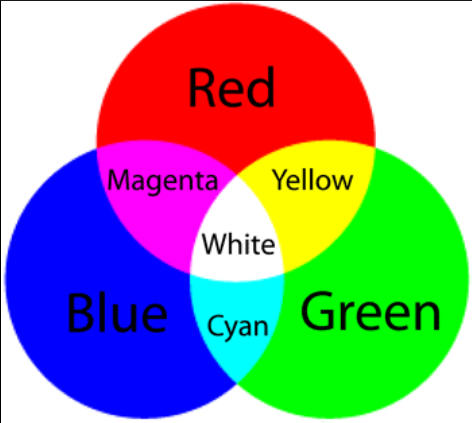

# Lesson 21: Understanding and mixing primary colours using an RGB LED
Last lesson, we looked at the LED with 4 legs is called a common cathode LED. Here we will mix primary colours to get differnet outputs.

## Schematic 
They are colour combinations that we will work with

## Program
The program shows how we LED can work with different colours. Using analogwrite we can get very specific colours on the arduino. 