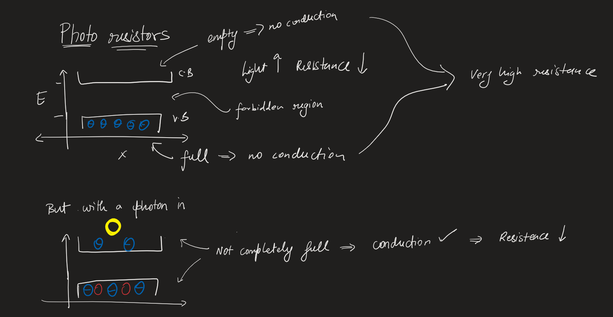
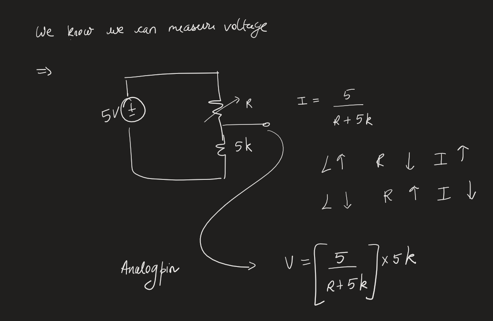

# Lesson 25: Understanding Photoresistors and Photo detectors
In this lesson, we will learn the basics of photo resistors and photo detectors.

Photoresistor will be measured by being connected in series with a resistor.

## Concept

Photoresistor measurements:
- Full brightness - 16k ohms
- No brightness - 1.5k ohms 

## Schematic

- Here the red LED lights up when the resistance is less and light is more
- The green LED lights up when the resistance is high and liight is less.