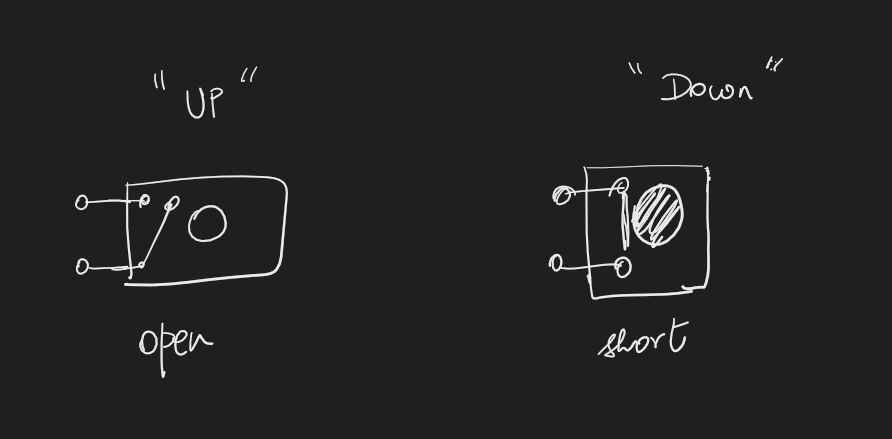
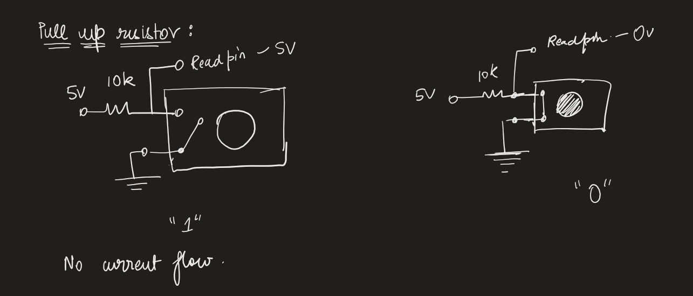
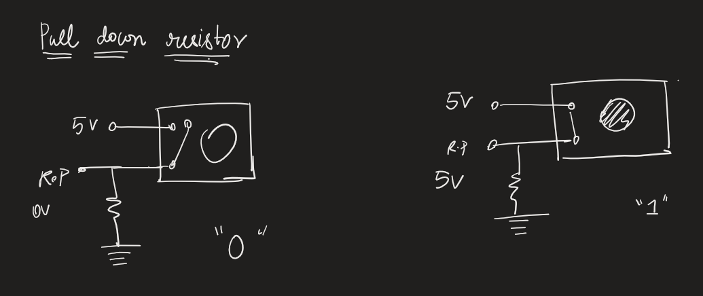

# Lesson 27: Understanding pushbuttons using pull up and pull down resistor combinations\
Push buttons are buttons that change state as long as they are pushed. They can be used in multiple ways. They can be arranged in 2 configurations

## On and off:

## Pull up resistor:

## Pull down resistor:

## Schematic:

In our program, the LED lights up the push button is pushed ("0") and turns off when the button is not ("1").

