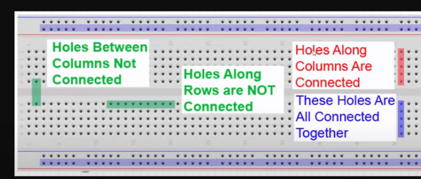
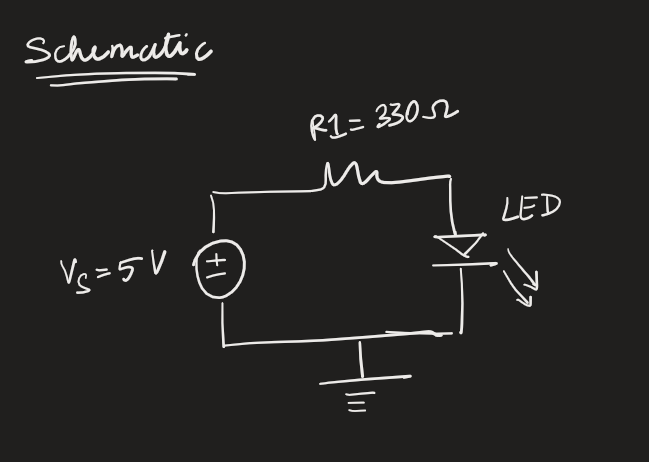

# Lesson 3 - How do breadboards work?
When board is horizontal.

- a-e: columns are connected 
- f-j: columns are connected
- 1-60 in a-e and f to j: are not connected
- Positve (+) and Negative (-) is connected along the row and not columns

Now we can have nice secure connections. 

## Basic single LED configuration
**Schematic**

Refer to line **10-14**

**Set-up**

## 3 LED successive blinking configuration

Refer to line **20-43**
