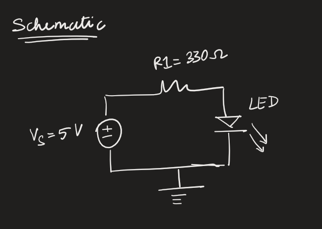

# Lesson 4: Morse code using variables
In this lesson we will display S.O.S in morse code using LEDs.

## Variables:
1. Variables containers in programming that store data. 
2. Why use them? It makes making changes to the code easy and makes the code neat. 
2. The can be declared based on what they have to store. Some data-types are:

|S.No| Data type      | Syntax                         |
|----|----------------|--------------------------------|
|1.  |Integer (int)   |int x = <em>number<em>          |
|2.  |Float (int)     |float x = <em>decimal number<em>|
|3.  |Unsigned integer|unsigned int x = <em>number<em> |
|4.  |String          |String myString = <em>"String in quotes"<em> |

## Excercise:
SOS in morse code is  . . . ---- . . . 
1. The dot duration has to be shorter and the dash duration has to be longer. 
2. Let us declare dot_time and dash_time as integer variables to set the time once
3. The output pin gets assigned to the variable blueLED.

## Basic single LED configuration
**Schematic**

## Homework
3 LEDs doing S.O.S Fast slow and very slow.
